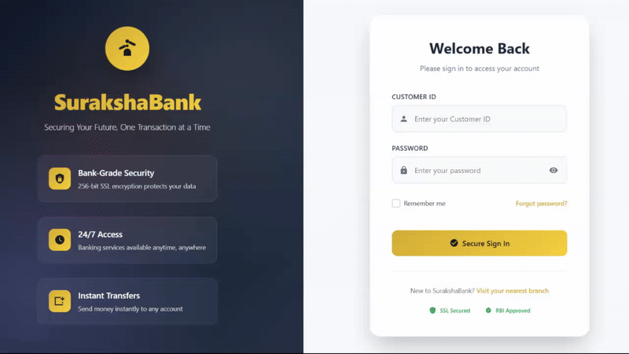

# SurakshaBank

**SurakshaBank** is a full-stack banking application that demonstrates secure financial transactions and account management capabilities. This project simulates a real banking environment with features for customers to view their accounts, transfer funds, and track transaction history.

## Features

- **Secure Authentication** - Customer ID and password-based login system
- **Account Dashboard** - View account summary and balance
- **Transaction Management** - Send, receive, and track financial transactions
- **Transaction History** - Detailed view of past transactions with status tracking
- **Bank-grade Security** - AES encryption to protect user data
- **Logging** - Logs are saved to files organized by date and type for easy troubleshooting and auditing.

## Screenshots

<div align="center">
   
</div>

## Project Structure

```
SurakshaBank/
├── backend/
│   ├── controllers/    # Functionalities
│   ├── db/             # Database setup
│   ├── enums/          # Constant values and enumerations
│   ├── models/         # Database models
│   ├── routes/         # API routes
│   ├── utils/          # Utility functions and logging
│   ├── middleware/     # Express middleware
│   ├── constants.js/   # Configuration constants
│   └── app.js          # Express application setup
│
├── frontend/
    ├── src/
    │   ├── pages/      # React components for pages
    │   ├── styles/     # CSS modules
    │   ├── App.jsx/     
    │   └── constants.js # Configuration constants
    └── index.html      # Entry HTML file
```

## Installation

1. Clone the repository

   ```
   cd bank
   ```

2. Install backend dependencies

   ```
   cd backend
   npm install
   npm run dev
   ```

3. Install frontend dependencies

   ```
   cd frontend
   npm install
   npm run dev
   ```
