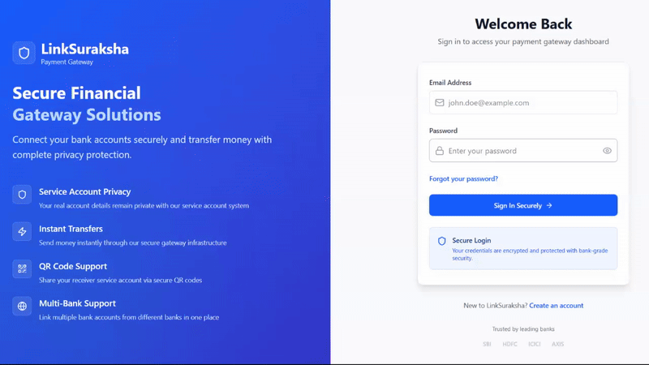
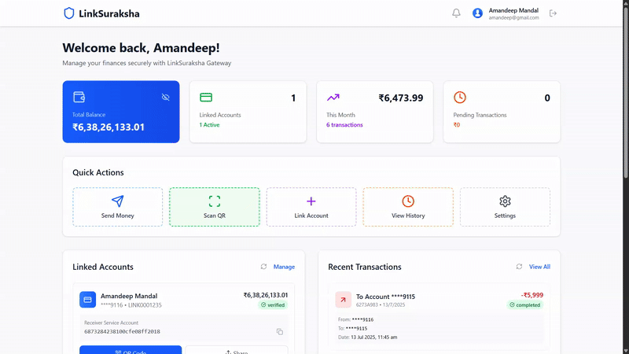

# LinkSuraksha

**LinkSuraksha** is a secure payment gateway system that provides seamless financial transactions with enhanced security features. The project consists of a robust backend API and a modern React frontend interface. Transactions takes place by Temporary Encrypted Service Accounts, doing so it helps to hide actual details of sender.

## Features

- **Secure Authentication** - JWT-based user authentication with role-based access control
- **Account Management** - Link and manage multiple bank accounts securely
- **Real-time Transactions** - Process payments with live status updates via Server-Sent Events (SSE)
- **QR Code Payments** - Quick payments through QR code scanning
- **Transaction History** - Comprehensive transaction tracking and management
- **Security First** - AES encryption for sensitive data and PIN management

## Screenshots

<div>
  <br/>
  <strong>Payment via Account Number</strong>
  <br/>
</div>

<div align="center">
  <br/>
   
  <br/>
</div>

<div>
  <br/>
  <strong>Payment via QR</strong>
  <br/>
</div>

<div align="center">
  <br/>
   
  <br/>
</div>

## Project Structure

```
backend/
├── controllers/     # Request handlers
├── middleware/      # Auth & validation middleware
├── models/         # MongoDB schemas
├── routes/         # API route definitions
├── utils/          # Helper utilities
└── enums/          # Application constants

frontend/
├── components/     # Reusable components
├── pages/         # Route components
├── services/      # API services
├── styles/        # CSS modules
└── enums/         # Frontend constants
```

## Installation

1. **Clone the repository**

   ```bash
   cd gateway
   ```

2. **Backend Setup**

   ```bash
   cd backend
   npm install
   npm run dev
   ```

3. **Frontend Setup**

   ```bash
   cd frontend
   npm install
   npm run dev
   ```
