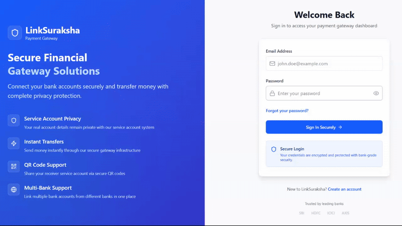

# LinkSuraksha

**LinkSuraksha** is a secure payment gateway system that provides seamless financial transactions with enhanced security features. The project consists of a robust backend API and a modern React frontend interface.

## Features

- **Secure Authentication** - JWT-based user authentication with role-based access control
- **Account Management** - Link and manage multiple bank accounts securely
- **Real-time Transactions** - Process payments with live status updates via Server-Sent Events (SSE)
- **Merchant Integration** - Dedicated merchant portal for business transactions
- **QR Code Payments** - Quick payments through QR code scanning
- **Transaction History** - Comprehensive transaction tracking and management
- **Security First** - AES encryption for sensitive data and PIN management
- **Role-based Access** - Admin and user role separation

## Screenshots

<div align="center">
  <strong>Payment via Account Number</strong>
</div>



<div align="center">
  <strong>Payment via QR</strong>
</div>


## Project Structure

```
backend/
├── controllers/     # Request handlers
├── middleware/      # Auth & validation middleware
├── models/         # MongoDB schemas
├── routes/         # API route definitions
├── utils/          # Helper utilities
└── enums/          # Application constants

frontend/
├── components/     # Reusable components
├── pages/         # Route components
├── services/      # API services
├── styles/        # CSS modules
└── enums/         # Frontend constants
```

## Installation

1. **Clone the repository**

   ```bash
   git clone https://github.com/GurnishS/LinkSuraksha-server.git
   cd linksuraksha
   ```

2. **Backend Setup**

   ```bash
   cd backend
   npm install
   cp .env.example .env
   # Configure your environment variables
   npm run dev
   ```

3. **Frontend Setup**

   ```bash
   cd frontend
   npm install
   npm run dev
   ```

4. **Environment Configuration**

   Create `.env` files in both backend and frontend directories:

   **Backend `.env`:**

   ```env
   PORT=8000
   MONGODB_URI=mongodb://localhost:27017/linksuraksha
   CORS_ORIGIN=http://localhost:5173
   JWT_SECRET=your-jwt-secret
   JWT_EXPIRY=7d
   ```

   **Frontend `.env`:**

   ```env
   VITE_API_URL=http://localhost:8000
   ```
