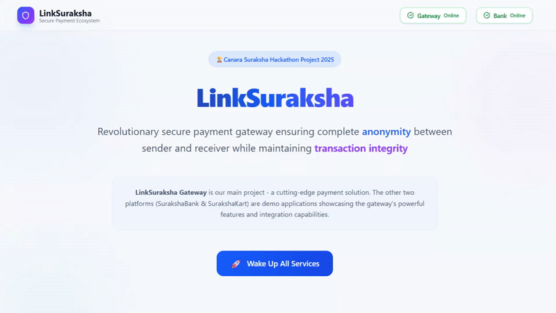

# LinkSuraksha Home - Developer Dashboard

<div align="center">
  
</div>

The **LinkSuraksha Home** is a developer dashboard and navigation hub designed to streamline development and monitoring of the entire LinkSuraksha ecosystem. This interface provides developers with quick access to all platform components and real-time service health monitoring.

## Purpose

This is **not a user-facing application** but rather a development tool that helps developers:

- **Navigate between services** - Quick links to all LinkSuraksha components
- **Monitor service health** - Check if all services are running properly
- **Centralized access** - Single point of entry for all development environments
- **Status overview** - Real-time monitoring of system components

## Features

### Service Navigation

- **Quick Access Links**: Direct navigation to all platform components
  - Banking System (SurakshaBank)
  - Gateway System (Core Platform)
  - Merchant Portal

## Screenshot

<div align="center">
   
</div>

## Project Structure

```
home/
├── public/
│   ├── logo.png          # LinkSuraksha branding
│   ├── team-photos/      # Team member photos
│   └── vite.svg         # Vite logo
├── src/
│   ├── App.jsx          # Main application component
│   ├── App.css          # Application styles
│   ├── main.jsx         # Entry point
│   └── constants.js     # Configuration constants
├── index.html           # HTML template
├── package.json         # Dependencies and scripts
└── vite.config.js       # Vite configuration
```

## Installation & Setup

1. **Navigate to the home directory**

   ```bash
   cd home
   ```

2. **Install dependencies**

   ```bash
   npm install
   ```

3. **Start the development server**

   ```bash
   npm run dev
   ```

4. **Access the dashboard**
   ```
   http://localhost:5171
   ```

## Monitoring Features

### Service Health Checks

- **Ping Tests**: Regular health checks to all service endpoints
- **Status Indicators**: Color-coded status for each service
  - 🟢 Green: Service running and responsive
  - 🔴 Red: Service down or unreachable

## Team Information

The dashboard displays information about the development team members:

- Team member photos and roles
- Contact information for collaboration

## Integration with Main Ecosystem

The Home dashboard integrates seamlessly with the LinkSuraksha ecosystem:

```
LinkSuraksha Development Flow
├── Home Dashboard (Entry Point)
│   ├── Navigate to → Gateway System
│   ├── Navigate to → Banking System
│   ├── Navigate to → Merchant Portal
│   └── Monitor → All Service Health
```

## Related Documentation

- [Main LinkSuraksha README](../README.md)
- [Gateway System](../gateway/README.md)
- [Banking System](../bank/README.md)
- [Merchant Portal](../merchant/README.md)
